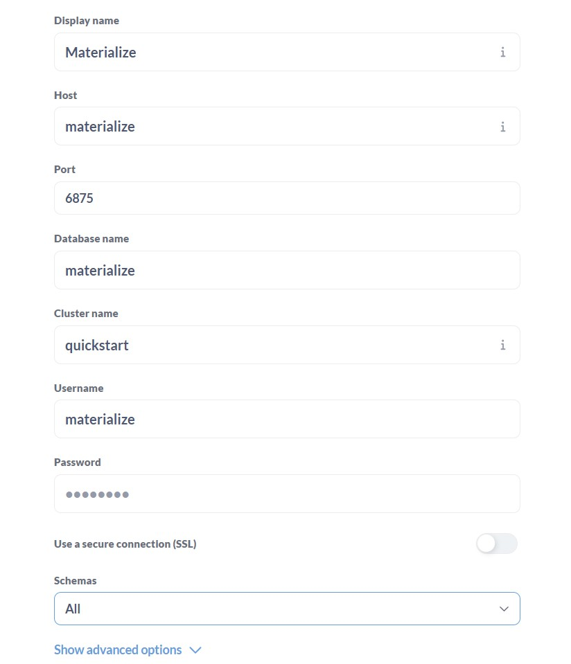
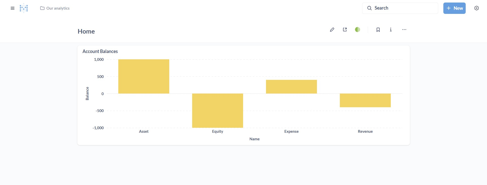

# Materialize Example
Example Materialize project.

## Setup
Install uv
```shell
scoop install uv
```

Install Python
```shell
uv python install 3.13
```

Create virtual environment
```shell
uv venv
```

Install dependencies
```shell
uv sync
```

Activate environment
```shell
./.venv/Scripts/activate
```

Install Pulumi
```shell
scoop install pulumi
```

Deploy
```shell
cd pulumi
pulumi up
```

Setup Metabase at http://localhost:3000



Run load data script
```shell
uv run load_data.py
```
> Useful to see data updated in Metabase

Tear down
```shell
cd pulumi
pulumi destroy
```

## Setup PyCharm
Create a Postgres database connection for materialize and select the following options.

