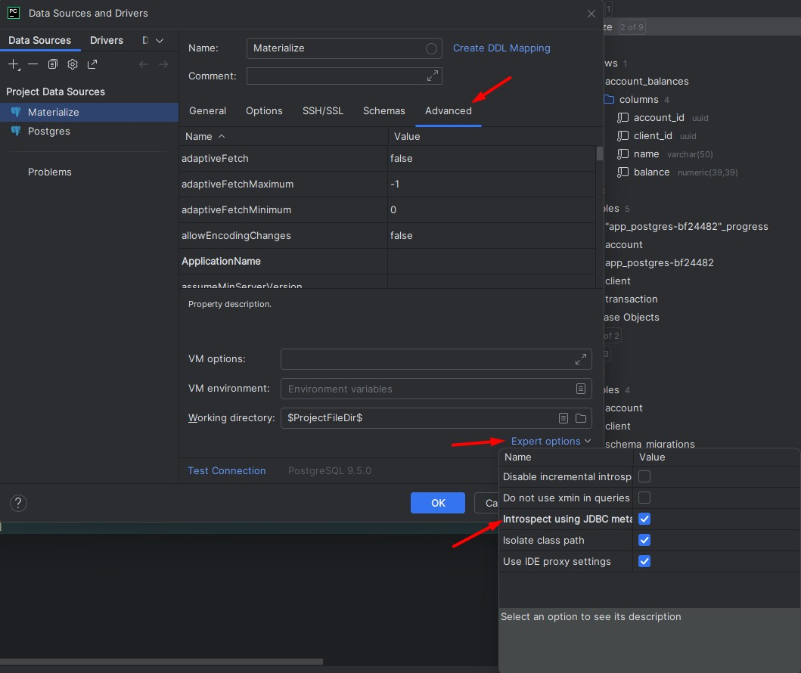
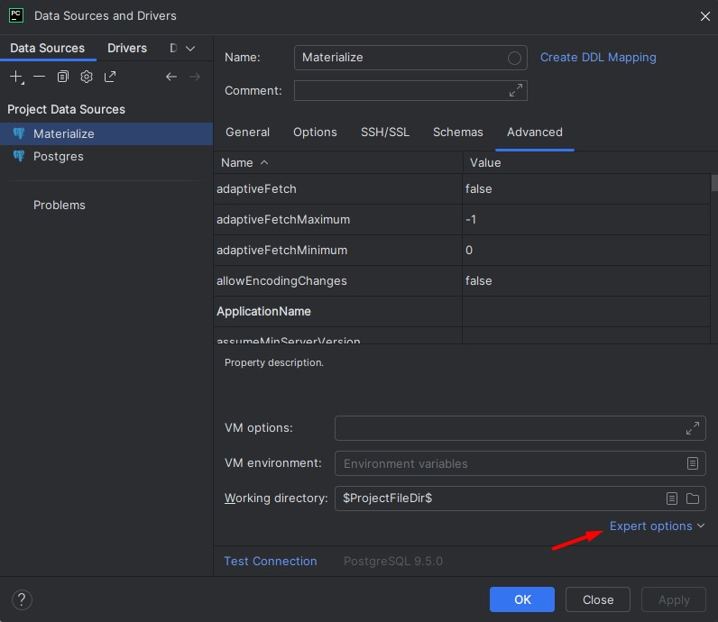
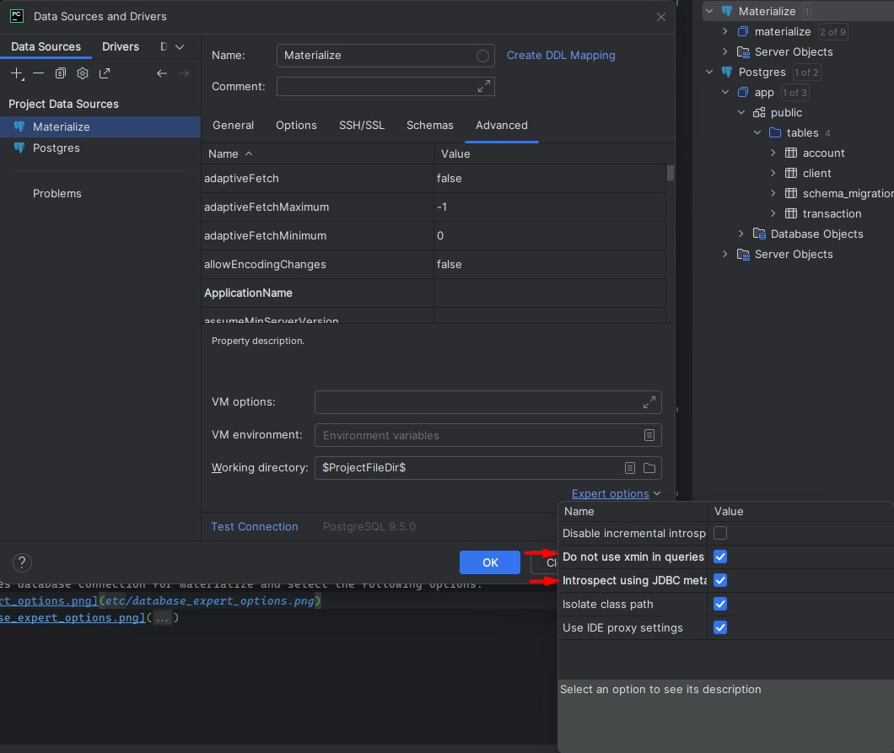

# Materialize Example
Example Materialize project.

## Setup
Install uv
```shell
scoop install uv
```

Install Python
```shell
uv python install 3.13
```

Install dependencies
```shell
uv sync
```

Install Pulumi
```shell
scoop install pulumi
```

## Usage
Deploy
```shell
pulumi up
```

Tear down
```shell
pulumi destroy
```

## Setup PyCharm
Create a Postgres database connection for materialize and select the following options.



